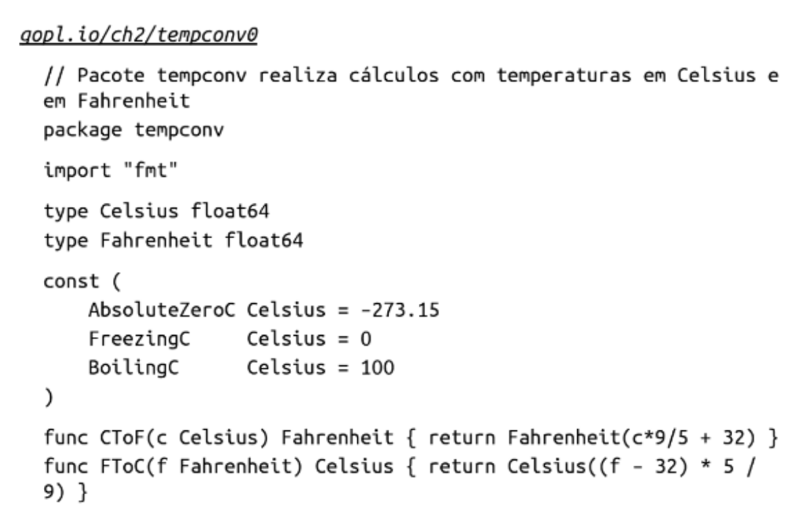

Table of contents
- [2.5 Declarações de Tipos](#conceito)

	
## Conceito
O tipo de uma variável ou expressão define as características dos valores que ela pode assumir. Por exemplo, seu tamanho (número de bits ou de elementos), como elas são representadas internamente, as operações que podem ser realizadas e os métodos associados a elas.

Os tipos mais comuns são float(32 ou 64), int e string

## Tipos nomeados x Tipos subjacentes

O `tipo nomeado` pode ser conveniente quanto á notação se ele ajuda a evitar a necessidade de escrever os tipos complexos repetidamente.
Tipos nomeados também possibilita definir novos comportamentos para os valores desse tipo. Esses comportamentos são expressos na forma de um conjunto de funções associadas ao tipo, chamadas de métodos de tipo.

O `tipo subjacente` tem pouca vantagem quando ele é de forma simples, ex.: float64, mas tem grande vantagem quando ele é mais complexo como veremos na parte de estruturas.
Pois ele determina a estrutura e representação e define o conjunto de operações intrínsecas
