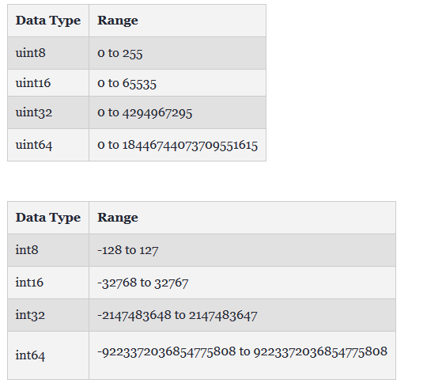

Table of contents
- [3 - Tipos de dados básicos ](#32-números-de-pontos-flutuantes)
  - [3.1.1 Inteiros](#inteiros)
  - [3.1.2 Float](#número-de-ponto-flutuante-float)
  - [3.1.3 Números Complexos](#números-complexos)
	
## Conceito
Quando falamos sobre tipos de dados estamos falando sobre o tipo de dados que uma variável Go válida pode conter. Na linguagem Go, o tipo é dividido em quatro categorias que são as seguintes:

1. **Tipo básico**: Números (que são os que veremos agora), strings e booleanos estão nesta categoria.
2. **Tipo agregado**: Array e structs estão nesta categoria.
3. **Tipo de referência**: Ponteiros, slices, maps, funções e canais estão nesta categoria.
4. **Tipo interface**: Interfaces são coleções nomeadas de assinaturas de métodos.

Aqui, discutiremos os tipos de dados básicos na linguagem Go. Os tipos de dados básicos são ainda categorizados em três subcategorias que são:
- Números <- (é sobre essa categoria que falaremos)
- Booleanos
- Strings

Dentro da categoria **Números** temos 3 subcategorias:

1 - Inteiros

2 - Números de ponto flutuante

3 - Números Complexos

# Inteiros
Na linguagem Go, os inteiros assinados e não assinados estão disponíveis em quatro tamanhos diferentes, conforme mostrado na tabela ao lado. O int assinado é representado por int e o inteiro sem sinal é representado por uint.

## Tamanho dos Números Permitidos

# Número de Ponto Flutuante (Float)
Na linguagem Go, os números de ponto flutuante são divididos em duas categorias, conforme mostrado na tabela abaixo:

# Números Complexos
Os números complexos são divididos em duas partes são mostrados na tabela abaixo. 
Float32 e Float64 também fazem parte desses números complexos. A função embutida cria um número complexo de sua parte imaginária e real e a função imaginária e real embutida extrai essas partes.

