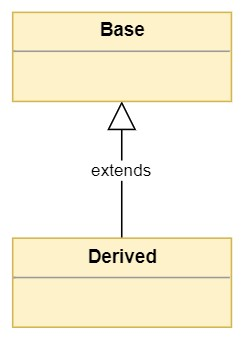
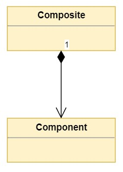

**Table of contents**
- [O que é herança?](#o-que-é-herança)
  - [Herança de interface](#herança-de-interface)
  - [Herança de implementação](#herança-de-implementação)
- [O que é composição?](#o-que-é-composição)
- [E agora? O que escolher?](#e-agora-o-que-escolher)


## O que é herança?

Herança é um princípio de orientação a objetos, que permite que classes compartilhem atributos e métodos, através de "heranças".



Existem dois tipo de herança:

### Herança de interface

Herança de interface é um relacionamento do tipo `ser`. Onde dizemos que uma classe derivada(sub-classe) é uma classe base.

```
abstract class Funcionario {
    private float salario;
    private String cargo;
    private String nome;
    
    abstract float getSalario();

    private getCargo(){
        return cargo
    }
}

class Vendedor extends Funcionario{
    private float comissao;
    
    public float getSalario(){
        return salario + comissao;
    }
}

class Gerente extends Funcionario {
    private float bonus;
    
    public float getSalario(){
        return salario + bonus;
    }
}

class FolhaSalarial{
    private Date data;
    
    public void imprimirFolhaSalarial(List funcionarios){
        for(Funcionario f : funcionarios){
            System.io.println(funcionario.getNome() + " ----- " + funcionario.getSalario());
        }
    } 
}
```

### Herança de implementação

Herança de implementação existe para evitar a duplicação de código por meio de reutilização.

> Na prática, ambos os usos muitas vezes são simultâneos, mas sempre que puder deixar a intenção clara, faça isso.
> Fluent Python - 407


## O que é composição?

Em ciência da computação, composição de objetos é uma maneira de se combinar objetos simples ou tipos de dados em objetos mais complexos. 

Objetos compostos são frequentemente referidos como tendo um relacionamento "tem um". Um exemplo de composição do mundo real pode ser visto em um automóvel: os objetos roda, volante, banco, transmissão e motor podem não ter utilidade funcionando isoladamente, mas um objeto chamado automóvel contendo todos estes objetos teria uma função muito útil, maior que a soma de todas as suas partes.

> Trecho retirado da wikipedia.



```
type Roda struct{}
func(r *Roda)Girar(){
    return 
}

type carro struct{
    Roda
    Freio
    Volante
    ...
}

type bicicleta struct{
    Roda
    Freio
}

```

## E agora? O que escolher?


Composition is fairly easy to understand - we can see composition in everyday life: a chair has legs, a wall is composed of bricks and mortar, and so on. While the definition of inheritance is simple, it can become a complicated, tangled thing when used unwisely. Inheritance is more of an abstraction that we can only talk about, not touch directly. Though it is possible to mimic inheritance using composition in many situations, it is often unwieldy to do so. The purpose of composition is obvious: make wholes out of parts. The purpose of inheritance is a bit more complex because inheritance serves two purposes, semantics and mechanics.


The most common - and beneficial - use of inheritance is for differential programming. We need a widget that is just like the existing Widget class, but with a few tweaks and enhancements. In this case, inherit away; it is appropriate because our subclass is still a widget, we want to reuse the entire interface and implementation from the superclass, and our changes are primarily additive.

> Trechos extraídos: https://www.thoughtworks.com/en-br/insights/blog/composition-vs-inheritance-how-choose


To favor composition over inheritance is a design principle that gives the design higher flexibility. It is more natural to build business-domain classes out of various components than trying to find commonality between them and creating a family tree.
> Trecho extraído: https://en.wikipedia.org/wiki/Composition_over_inheritance